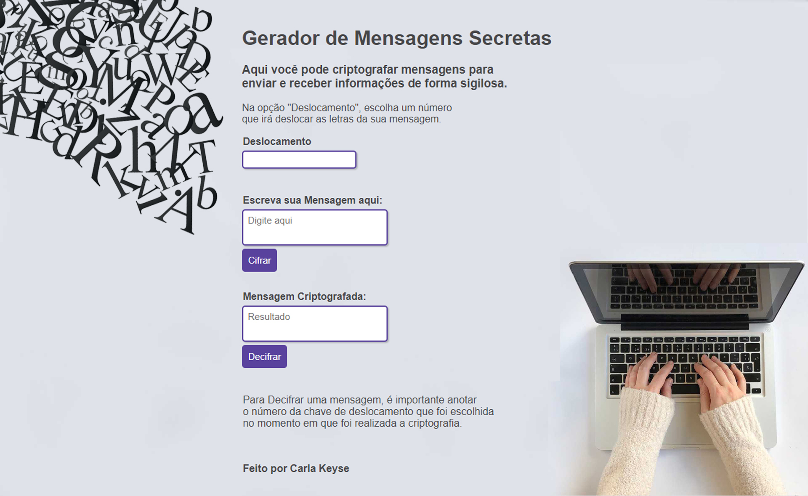

# Cifra de César - Gerador de Mensagens Secretas

## Índice

* [1. Apresentação do Projeto](#1-prefácio)
* [2. Tema e objetivo do projeto](#2-resumo-do-projeto)
* [3. Usuários](#3-objetivos-de-aprendizagem)
* [4. UX e UI](#4-considerações-gerais)
* [5. Conteúdo Aprendido](#5-critérios-de-aceitação-mínimos-do-projeto)
* [6. Autoria](#6-hacker-edition)

***

## 1. Apresentação do Projeto

Esta é a primeira aplicação web realizada no _bootcamp SAP006 da Laboratória_.
Nela foi aplicada a técnica de critptografia "Cifra de César" onde é ´possível cifrar e decifrar um texto indicando uma chave de deslocamento (_offset_).

A cifra de César é uma das técnicas mais simples de cifrar uma mensagem. É um
tipo de cifra por substituição, em que cada letra do texto original é
substituida por outra que se encontra há um número fixo de posições
(deslocamento) mais a frente do mesmo alfabeto.

Por exemplo se usarmos o deslocamento (_offset_) de 3 posições:

* Alfabeto sem cifrar: A B C D E F G H I J K L M N O P Q R S T U V W X Y Z
* Alfabeto com cifra:  D E F G H I J K L M N O P Q R S T U V W X Y Z A B C
* A letra A será D
* A palavra CASA será FDVD

## 2. Tema e objetivo do Projeto

Gerar mensagens secretas para trocas de mensagens de forma sigilosa. 
Nessa aplicação o usuário poderá escolher uma chave, digitar o texto que deseja criptografar, gerar seu código e enviar para quem ele quiser por _Email_ ou _WhatsAPP_, por exemplo.
A pessoa que receber o código, poderá abrir a aplicação, inserir a chave, o código e decifrar o texto.

## 3. Usuários

Pessoas que queiram trocar mensagens sobre qualquer assunto com sigilo e privacidade.

## 4. UX e UI

* A aplicação foi pensada e desenhada para ser bem simples e objetiva. A prioridade é que o usuário obtenha sua mensagem secreta de forma clara e rápida.

* Para Cifrar:
O usuário deve escolher uma chave, digitar o texto desejado no espaço _"Escreva sua Mensagem aqui"_ e clicar no botão _CIFRAR_. É muito importante que o usuário anote a chave que foi escolhida para que seja utilizada na hora de decifrar.

* Para Decifrar:
O usuário deve digitar a mesma chave que foi utilizada na hora de criptografar, inserir a mensagem no espaço _"Mensagem Criptografada"_ e clicar no botão _DECIFRAR_.

## 5. Conteúdo Aprendido

### HTML e CSS

* [ ] [Uso de HTML semântico.](https://developer.mozilla.org/pt-BR/docs/Glossario/Semantica#Sem%C3%A2ntica_em_HTML)
* [ ] Uso de seletores de CSS.

### DOM

* [ ] Uso de seletores do DOM.
* [ ] Manipular eventos do DOM.
* [ ] [Manipulação dinâmica do DOM.](https://developer.mozilla.org/pt-BR/docs/DOM/Referencia_do_DOM/Introdu%C3%A7%C3%A3o)
(appendChild |createElement | createTextNode| innerHTML | textContent | etc.)

### JavaScript

* [ ] Manipulação de strings.
* [ ] Uso de condicionais (if-else | switch | operador ternário)
* [ ] Uso de laços _(loops)_ (for | for..in | for..of | while)
* [ ] Uso de funções (parâmetros | argumentos | valor de retorno)
* [ ] Declaração correta de variáveis (const & let)

### Testing

* [ ] [Teste unitário.](https://jestjs.io/docs/pt-BR/getting-started)

### Estrutura do código e guia de estilo

* [ ] Organizar e dividir o código em módulos (Modularização)
* [ ] Uso de identificadores descritivos (Nomenclatura | Semântica)
* [ ] Uso de linter (ESLINT)

### Git e GitHub

* [ ] Uso de comandos de git (add | commit | pull | status | push)
* [ ] Gerenciamento de repositorios de GitHub (clone | fork | gh-pages)

### UX

* [ ] Desenhar a aplicação pensando e entendendo o usuário.
* [ ] Criar protótipos para obter feedback e iterar.
* [ ] Aplicar os princípios de desenho visual (contraste, alinhamento, hierarquia)

## 6. Autoria

Projeto feito por [@carlakeyse](https://github.com/carlakeyse) para o _Bootcamp Laboratória_ SAP006.

